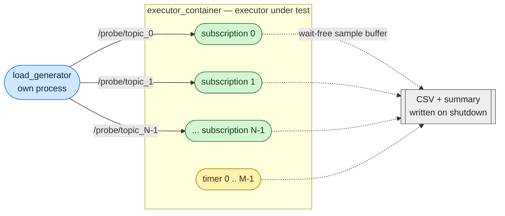

# executor_comparison

Performance comparison of the callback executors available in ROS 2 Lyrical Luth.

A load generator publishes stamped probe messages onto `N` topics. Every one of
those topics is subscribed by bench nodes loaded into a composable container
whose executor is the thing under test, so the only work that executor does is
dispatching the callbacks being measured. Each callback records when the
executor got round to it, how long it ran, and on which thread; a writer
component in the same container emits per-callback + summary CSVs (plus process
CPU and context-switch counts) to `data/results/`.



The generator runs in its own process by default, so its publish timer never
competes for the executor being measured. Set `generator_mode:=composed` to
load it into the container instead, which is the only configuration where
`use_intra_process_comms` means anything.

## Results

<!-- Populate img/ with the PNGs from data/results once you have a full run.
     ./run_all.sh writes them; the title and subtitle are pulled from the CSV
     metadata, so the CPU model, OS and kernel shown reflect the machine that
     *produced* the data, not the one running the plotter. -->

_No runs committed yet — `./run_all.sh` and drop the resulting PNG in `img/`._

## Quick start

```shell
git clone https://github.com/MShields1986/executor_comparison.git
cd executor_comparison

# Run one executor end-to-end (no plot):
./run_single.sh events_cbg

# Run every executor across the default matrix and then plot:
./run_all.sh
# override the list:
./run_all.sh "single_threaded events_cbg"
```

Results land in `data/results/` as
`executor_<exec>_<T>t_<N>n_<S>s_<M>tm_<payload>B_<rate>hz_<work>us_<cbg>_<ipc|noipc>_<rmw>_<ts>.csv`,
each with a `#`-prefixed metadata header (run config, resource usage, host,
CPU, OS, kernel). `run_all.sh` additionally emits an `executors_*.png`.

## What is actually measured

| column / metric | meaning |
|---|---|
| `latency_ns` (subscription) | callback entry minus the publisher's pre-publish stamp — **dispatch latency**, the headline number |
| `latency_ns` (timer) | actual interval minus nominal period — **period error**; first tick records 0 |
| `exec_ns` | time spent inside the callback (≈ `callback_work_us` plus clock overhead) |
| `thread_slot` | which executor thread ran the callback; shows whether the callback groups actually bought any parallelism |
| `# cpu_percent_mean` | process CPU sampled at 10 Hz for the whole run |
| `# voluntary_ctx_switches` | context switches over the run — the events executors claim fewer |
| `# samples_dropped` | gaps in the per-topic sequence numbers |
| `# samples_overflowed` | samples discarded because a recording buffer filled up (should be 0) |
| `# throughput_pct` | callbacks serviced over what the configured rate should have delivered |
| `# latency_mean_ns` | mean dispatch latency, for comparison with benchmarks that report means rather than percentiles |
| `# publish_window_s` | the window throughput is measured over (see below) |

Recording is deliberately wait-free: callbacks bump an atomic index and write
into a preallocated buffer, with no allocation, no locking and **no ROS traffic
on the hot path**. Publishing a record message per callback — the approach
[ros_latency_tests](https://github.com/MShields1986/ros_latency_tests) uses —
would push the executor under test through an extra publish per callback and
measure that instead.

Timestamps come from `CLOCK_MONOTONIC`, which is system wide on Linux, so the
generator's stamp stays comparable across the process boundary.

Throughput is measured against the window the generator was *actually*
publishing over, not `duration_s`. Launch shutdown is not instant, so the run
overruns its nominal duration by a couple of percent, which would otherwise
show up as a steady ~102% throughput. The window is taken globally across
topics rather than per topic, so a starved topic cannot shrink its own
denominator and hide the starvation.

### Comparing against the published benchmarks

The [Polymath write-up][polymath] by one of the events-executor authors sweeps
three axes — executor, thread count (1 vs 8) and intra-process vs middleware —
over a fixed topology of 50 topics at 63–1978 Hz carrying 1 MB messages, in a
single process, and reports **throughput**, **mean** latency and CPU.

The thing to match is not just the axes but the *regime*. That topology is
deliberately saturating (~60k msg/s of 1 MB payloads), so the differentiator is
how much traffic gets serviced at all, and the headline gaps come from there. A
run that never drops a message is measuring something else, and executors that
look identical unsaturated can differ by an order of magnitude once overloaded.
To get into that regime:

```shell
MATRIX_EXECUTORS="single_threaded multi_threaded events events_cbg" \
MATRIX_THREADS="1 8" \
MATRIX_SUBS="50" \
MATRIX_MODES="multi_rate" \
MATRIX_RATE_MIN=63.0 MATRIX_RATE_MAX=2000.0 \
MATRIX_PAYLOADS="1048576" \
MATRIX_GENERATOR="composed" \
MATRIX_DURATION=20.0 \
./run_all.sh
```

`MATRIX_GENERATOR=composed` puts the publishers in the same process — and
therefore on the same executor — as the subscriptions, which is what the
reference topology does, and is a prerequisite for `MATRIX_IPCS=true` to mean
anything. Note that a 1 MB payload is what makes the intra-process axis
dominate: with IPC on and `unique_ptr` publishing rclcpp moves a pointer, while
the middleware path has to actually move the bytes.

[polymath]: https://www.polymathrobotics.com/blog/execution-management-in-rclcpp

## Knobs

Pass launch args after the service name via `docker compose run`, e.g.

```shell
docker compose -f docker/docker-compose.yaml run --rm events_cbg \
  ros2 launch executor_comparison executor_bench.launch.py \
    executor:=events_cbg \
    num_subscriptions:=100 \
    num_threads:=4 \
    callback_group:=reentrant \
    callback_work_us:=500 \
    publish_rate_hz:=200.0 \
    duration_s:=30.0
```

| launch arg                | default              | notes |
|---------------------------|----------------------|-------|
| `executor`                | `single_threaded`    | see the table below |
| `num_threads`             | `0`                  | worker threads (0 = hw concurrency); ignored by the single-threaded executors; maps to `reentrant_parallelism` for `callback_isolated` |
| `num_nodes`               | `1`                  | how many bench nodes the entities are spread over |
| `num_subscriptions`       | `10`                 | total subscriptions across all bench nodes |
| `num_timers`              | `0`                  | total timers across all bench nodes |
| `timer_period_ms`         | `10.0`               | period of every bench timer |
| `publish_rate_hz`         | `100.0`              | per-topic publish rate |
| `publish_mode`            | `burst`              | `burst` = every topic on the same tick; `round_robin` = one topic per tick at the same aggregate rate; `multi_rate` = one timer per topic, rates spread across `rate_min_hz`..`rate_max_hz` |
| `rate_min_hz`             | `63.0`               | lowest per-topic rate, `multi_rate` only |
| `rate_max_hz`             | `2000.0`             | highest per-topic rate, `multi_rate` only |
| `payload_bytes`           | `1024`               | size of the probe `payload` field (message overhead is on top) |
| `callback_work_us`        | `0.0`                | busy-wait performed inside every callback |
| `callback_group`          | `mutually_exclusive` | see the table below |
| `generator_mode`          | `process`            | `process` (own process) or `composed` (into the container under test) |
| `use_intra_process_comms` | `false`              | rclcpp zero-copy IPC; rejected unless `generator_mode:=composed`, since otherwise the publisher is in another process and the messages go through the middleware regardless |
| `qos_depth`               | `10`                 | `KEEP_LAST` depth on the probe topics (reliable) |
| `warmup_s`                | `5.0`                | delay before the generator starts publishing |
| `duration_s`              | `60.0`               | seconds of publishing before the launch shuts itself down |
| `run_id`                  | timestamp            | unique id for this run |
| `output_dir`              | `/data/results`      | directory (inside the container) to write CSVs into |

## Test matrix (`run_all.sh`)

`run_all.sh` runs the cartesian product of every axis. Each axis is a
space-separated list and can be overridden from the environment:

```shell
MATRIX_EXECUTORS="single_threaded events_cbg" \
MATRIX_SUBS="1 10 100" \
MATRIX_THREADS="1 4" \
MATRIX_CBGS="mutually_exclusive reentrant" \
MATRIX_WORK_US="0 500" \
MATRIX_RATE=200.0 \
MATRIX_DURATION=30.0 \
./run_all.sh
```

The default matrix sweeps subscription count (`1 10 100`), because that is
where the two executor families diverge: a wait set is rebuilt and rescanned
per wakeup, so its cost grows with the number of entities, while an events
queue only ever touches the entity that actually became ready.

Legacy form `./run_all.sh "single_threaded events_cbg"` still works — the
positional argument replaces `MATRIX_EXECUTORS`. When every axis is a single
value, the matrix collapses to a single run.

## Supported executors

| service / key | rclcpp class | threads | status |
|---|---|---|---|
| `single_threaded` | `rclcpp::executors::SingleThreadedExecutor` | 1 | ✅ baseline; what plain `rclcpp::spin()` and a bare `component_container` give you |
| `multi_threaded` | `rclcpp::executors::MultiThreadedExecutor` | N | ✅ parallelism bounded by the callback groups |
| `events_cbg` | `rclcpp::executors::EventsCBGExecutor` | N | ✅ new in Lyrical; events queue instead of a wait set |
| `events` | `rclcpp::experimental::executors::EventsExecutor` | 1 | ✅ experimental, predates `events_cbg` |
| `callback_isolated` | [`CallbackIsolatedExecutor`][cie] (TIER IV / Autoware) | one per callback group | ✅ third-party; see below |
| `static_single_threaded` | `rclcpp::executors::StaticSingleThreadedExecutor` | 1 | ⚠ removed in Lyrical — only built when compiled against an older distro |

[cie]: https://github.com/autowarefoundation/callback_isolated_executor

The set is probed with `__has_include` in
`src/executor_comparison/src/executor_factory.cpp`, so the same source builds
either side of the `StaticSingleThreadedExecutor` removal and the
`EventsCBGExecutor` addition, and `--executor-type` will list what is actually
available if you ask for one that is not.

Upstream's own `component_container --executor-type {single-threaded,
multi-threaded, events-cbg}` covers three of these; this repo uses its own
container executable so the experimental `EventsExecutor` is reachable by the
same mechanism and so the CSVs can be written once spin returns. Hyphenated
spellings are accepted too.

`--isolated` containers (one executor per component) are not an executor as
such and are out of scope here; see upstream `component_container --isolated`.

### `callback_isolated`

[callback_isolated_executor][cie] gives **every callback group its own thread**,
each running a dedicated `SingleThreadedExecutor` (or, for reentrant groups, a
multi-threaded one with `reentrant_parallelism` threads). The point is that the
OS scheduler then becomes the arbiter: with one thread per callback group you
can set a policy, priority and affinity per group, which is what its companion
`cie_thread_configurator` node does.

Three things make it different from the others here:

- **It is not selectable through `--executor-type`.** `CallbackIsolatedExecutor::spin()`
  snapshots the callback groups once and then spawns and joins its threads, so
  nodes loaded *after* spin — which is exactly how composable nodes arrive — are
  never picked up. Upstream's answer is a bespoke `ComponentManagerCallbackIsolated`
  that spawns the threads at load time, shipped as the
  `component_container_callback_isolated` executable. The launch file switches to
  that container automatically for `executor:=callback_isolated`; asking our own
  container for it prints an explanation rather than failing obscurely.
- **`num_threads` means `reentrant_parallelism`.** Thread count is otherwise a
  property of the callback group layout, not a knob. With
  `callback_group:=per_entity` you get one thread *per subscription*, so
  `num_subscriptions:=100` means 100 threads — that is the design, but it is
  worth knowing before you sweep it.
- **It needs a patch to build on Lyrical.** Upstream targets Humble/Jazzy. The
  Docker build clones it at a pinned commit and applies
  `patches/0001-lyrical-port.patch`, which fixes the removal of
  `ament_target_dependencies` and the `rclcpp::Executor` virtuals that now take
  `const &`. Nothing behavioural is touched — see [`patches/README.md`](patches/README.md).

Because it is cloned at build time, `callback_isolated` only works in the Docker
image; there is no vendored copy in `src/`.

## Callback groups

| value | behaviour |
|---|---|
| `default` | everything on the node's default (mutually exclusive) group |
| `mutually_exclusive` | one shared mutually exclusive group — no two callbacks ever run in parallel |
| `reentrant` | one shared reentrant group — anything may run in parallel with anything, including itself |
| `per_entity` | one mutually exclusive group *each* — entities run in parallel with each other but never with themselves |

This axis matters more than it looks: `multi_threaded` with
`callback_group:=mutually_exclusive` serialises everything and performs like
`single_threaded` while still paying for the threads. `per_entity` is usually
the configuration real code should be using, and the one where the
multi-threaded executors actually earn their keep.

## Notes and caveats

- The middleware is not an axis of the comparison, but it does set the floor on
  dispatch latency. All three of `rmw_cyclonedds_cpp`, `rmw_fastrtps_cpp` and
  `rmw_fastrtps_dynamic_cpp` are installed in the one image and selected at run
  time via `RMW_IMPLEMENTATION` (default: CycloneDDS); whichever was actually
  loaded is recorded in every CSV.
- Because the RMW is a run-time choice, every executor service shares a single
  image — only the first `--build` is slow.
- `std_msgs` primitives aren't used here; the probe message carries its own
  sequence number and publish stamp, so correlation never depends on a header.
- The process the CPU numbers describe is the container, which also runs the
  component manager. With `generator_mode:=composed` it runs the generator too,
  so cross-executor CPU comparisons are only fair within one `generator_mode`.
- Sample buffers are sized from `publish_rate_hz`, `duration_s` and `warmup_s`
  at launch time. If `# samples_overflowed` is non-zero the run outgrew them
  and the tail of it is missing — raise `sample_capacity`.
- CSV writing lives in the `MetricsWriter` component rather than in the
  container executable, so the harness works under a container we do not own.
  It writes from its destructor, which runs once the container has cancelled
  its executors — samples are held by `shared_ptr` in a process-global
  registry, so they survive whichever component is destroyed first.
